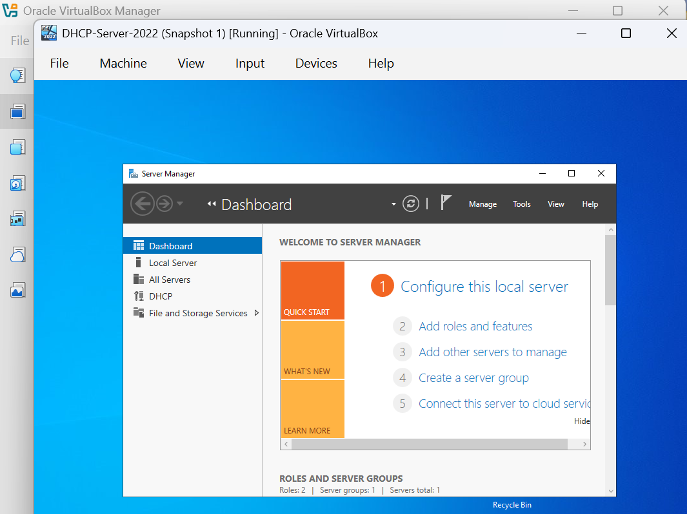

# Server Setup

## Overview

This section documents the initial setup of the Windows Server 2022 virtual machine that will be used as the DHCP server.

## Server Information

| Setting | Configuration |
|---|---|
| Operating System | Windows Server 2022 |
| Server Name | `DHCP-Server-2022` |
| Server Role | DHCP Server |
| Network | `192.168.10.0/24` |

## Setup Steps

1. Start the Windows Server 2022 virtual machine.
2. Log in with an administrator account.
3. Open **Server Manager**.
4. Verify that the server is identified as `DHCP-Server-2022`.
5. Confirm that the server is connected to the correct virtual network.
6. Proceed with static IP configuration.

## Verification

Confirm that:

- Windows Server 2022 is running.
- The server name is correct.
- Server Manager opens successfully.
- The server has network connectivity.
- The server is ready for network configuration.

## Screenshot

## Result

The Windows Server 2022 virtual machine is prepared for DHCP Server configuration.
